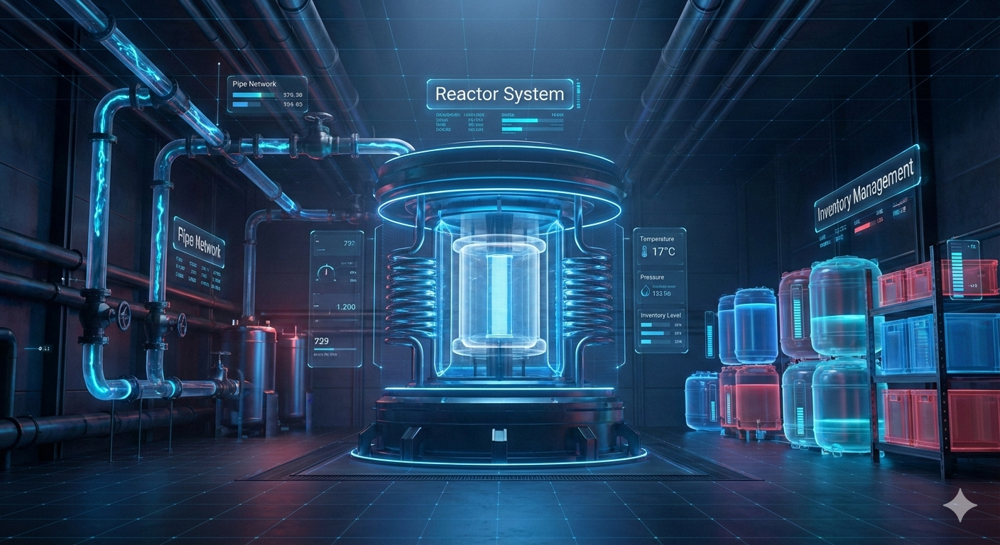

# NovaOps Industrial AI Reactor Monitor

## Project Overview
NovaOps is a real-time industrial reactor monitoring and analytics platform that combines a futuristic digital twin UI, live telemetry ingestion, anomaly detection, and AI-assisted operations support. It provides a high-signal operator experience for monitoring conversion efficiency, equilibrium drift, anomalies, and system health.

## Table of Contents
- [Project Overview](#project-overview)
- [Tech Stack (Versions)](#tech-stack-versions)
- [Features](#features)
- [Screenshots](#screenshots)
- [Prerequisites](#prerequisites)
- [Installation](#installation)
- [Configuration](#configuration)
- [Run Commands](#run-commands)
- [API Documentation](#api-documentation)
- [Project Structure](#project-structure)
- [Contribution Guidelines](#contribution-guidelines)
- [License](#license)

## Tech Stack (Versions)
### Frontend
- React: 19.2.0
- React DOM: 19.2.0
- Vite: 7.3.1
- TypeScript: ~5.9.3
- Tailwind CSS: 3.4.17
- Recharts: 3.7.0
- MQTT.js: 5.15.0
- Zustand: 5.0.11
- Lucide React: 0.564.0
- @google/model-viewer: 4.1.0
- Vitest: 4.0.18
- ESLint: 9.39.1

### Backend
- FastAPI (version not pinned)
- Uvicorn (version not pinned)
- WebSockets (version not pinned)
- scikit-learn (version not pinned)
- numpy (version not pinned)
- pandas (version not pinned)
- joblib (version not pinned)
- matplotlib (version not pinned)
- seaborn (version not pinned)
- pydantic (version not pinned)
- pytest (version not pinned)

## Features
### Digital Twin Reactor View
Interactive 3D reactor model with hotspot overlays and status badges. Clicking a hotspot focuses the model and reveals live sensor annotations for that zone.

**Usage example**
- Open the app and select **Overview**.
- Click a hotspot to focus the digital twin camera and reveal zone sensor readings.

### ESP Telemetry Dashboard (MQTT)
- Live ESP telemetry stream (flow, temperature, pressure, pH)
- Conversion Rate KPI and trend chart
- Equilibrium Drift gauge, advisory, and trend chart
- Anomaly timeline visualization and session KPIs

**Usage example**
- Select **ESP Telemetry** in the sidebar.
- When MQTT updates arrive, cards and charts update in real time.
- When a sensor crosses the bad threshold, the webhook alert triggers once per transition.

### AI Assistant (RAG Chat)
- Chat interface that posts operator questions to a backend endpoint for contextual responses.

**Usage example**
- Select **AI Assistant** in the sidebar.
- Ask a question like “Why is drift increasing?” to get a response.

### Anomaly Detection & Alerts
- Anomaly timeline shows discrete anomaly intervals.
- n8n webhook integration sends alerts when a sensor transitions from good → bad.

## Screenshots
Current visual reference:
- 

Add UI screenshots as they are captured:
- ESP telemetry dashboard
- Conversion and drift analytics panels
- AI assistant view

## Architecture
- [Solution architecture](Solution%20architecture.pdf)

## Prerequisites
### Frontend
- Node.js 18+ (recommended)
- npm 9+

### Backend
- Python 3.11
- pip

## Installation
### 1) Clone the repository
```bash
git clone <your-repo-url>
cd nova_monorepo
```

### 2) Frontend dependencies
```bash
cd frontend
npm install
```

### 3) Backend dependencies
```bash
cd ../backend
python -m venv .venv
.\.venv\Scripts\activate
pip install -r requirements.txt
```

## Configuration
### Frontend Environment
Create `frontend/.env`:
```
NEXT_PUBLIC_N8N_SENSOR_ALERT_URL=https://<N8N_DOMAIN>/webhook/sensor-alert
```

### MQTT Telemetry
The ESP telemetry subscribes to:
- Broker: `wss://7ebd6f06ccae49478ac407523133bf18.s1.eu.hivemq.cloud:8884/mqtt`
- Topic: `factory/reactor1/sensors`

### Backend RAG
Default backend host: `http://localhost:8000`
The AI Assistant posts to: `POST /rag/chat`

## Run Commands
### Frontend
- Development:
```bash
cd frontend
npm run dev
```
- Production build:
```bash
npm run build
```
- Preview production build:
```bash
npm run preview
```
- Lint:
```bash
npm run lint
```
- Tests:
```bash
npm run test
```

### Backend
- Development:
```bash
cd backend
python main.py
```
or
```bash
uvicorn main:app --reload --port 8000
```

- Production:
```bash
uvicorn main:app --host 0.0.0.0 --port 8000
```

- Tests:
```bash
pytest
```

## API Documentation
### WebSocket
- `ws://localhost:8000/ws`
- Streams sensor updates and anomaly events.

### RAG Chat
- `POST http://localhost:8000/rag/chat`
- Request body:
```json
{
  "question": "Why is conversion drifting?"
}
```
- Response body:
```json
{
  "answer": "..."
}
```

## Project Structure
```
nova_monorepo/
├─ backend/
│  ├─ main.py
│  ├─ requirements.txt
│  └─ rag/
├─ frontend/
│  ├─ public/
│  ├─ src/
│  ├─ package.json
│  └─ vite.config.ts
├─ IMPLEMENTATION.md
└─ README.md
```

## Contribution Guidelines
1. Create a feature branch from `main`.
2. Keep changes focused and well tested.
3. Run lint and tests before opening a PR.
4. Provide clear PR descriptions and screenshots for UI changes.

## License
License not specified. Add a LICENSE file to define usage terms.
